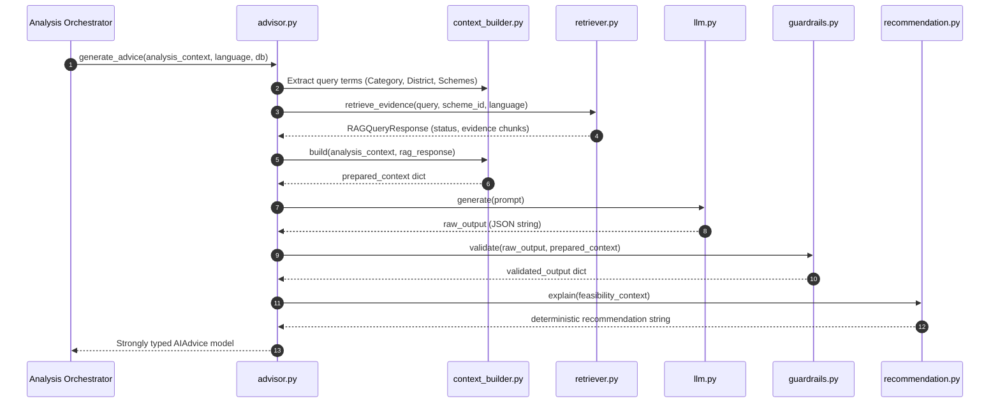

# 🤖 UdyamAI - AI Advisory & RAG Integration Specification

**Version:** 1.0.0  
**Status:** Active / Production Contract  
**Primary Modules:** `backend/app/ai/` and `backend/app/rag/`  

---

## 📌 1. Overview & Non-Negotiable AI Boundary

The **UdyamAI AI Advisory Layer** provides clear, culturally contextualized, multilingual business guidance for rural and semi-urban micro-entrepreneurs. It synthesizes complex numerical analyses (financial capacity, market reach, competitor density, feasibility scores, and government scheme eligibility) into actionable business narratives.

```mermaid
flowchart LR
    subgraph Deterministic Backend "Deterministic Backend Core (Source of Truth)"
        Calc[Finance Engine]
        Market[Market & Competition Services]
        Feas[Feasibility Scorer]
        Scheme[Scheme Matcher]
    end

    subgraph AI Advisor "AI Advisory Layer (Narrative & Explanations Only)"
        Ctx[AnalysisContext]
        RAG[RAG Evidence Retriever]
        Prompt[Layered Prompt Builder]
        LLM[LLM Provider Engine]
        Guard[Output Guardrails & Sanitizer]
        Advice[Structured AIAdvice]
    end

    Calc --> Ctx
    Market --> Ctx
    Feas --> Ctx
    Scheme --> Ctx

    Ctx --> Prompt
    RAG --> Prompt
    Prompt --> LLM
    LLM --> Guard
    Guard --> Advice
```

### 🔒 Non-Negotiable AI Boundary Rules

> [!IMPORTANT]
> **Core Architectural Constraints**
> 1. **AI Never Computes Numbers**: Feasibility scores, loan amounts, subsidy values, and EMI installments are strictly computed by Python services prior to invoking the AI.
> 2. **AI Never Overrides Ground Truth**: The model cannot alter eligibility determinations, credit caps, or spatial reach numbers passed in `AnalysisContext`.
> 3. **Fact Grounding via RAG**: Any scheme rule, subsidy percentage, or guideline referenced by the AI must be grounded in verified RAG evidence retrieved from official government documents.
> 4. **No Fictitious Financial Guarantees**: Phrases such as *"guaranteed loan approval"*, *"100% subsidy guaranteed"*, or unsubstantiated percentage figures are strictly blocked by guardrail filters.

---

## 🏢 2. Service Ownership & Architecture

| Module | File Path | Core Responsibility |
|---|---|---|
| `advisor.py` | `backend/app/ai/advisor.py` | Top-level advisor orchestrator coordinating RAG queries, prompt creation, LLM execution, guardrails, and graceful fallbacks |
| `context_builder.py` | `backend/app/ai/context_builder.py` | Transforms strongly typed `AnalysisContext` and retrieved RAG chunks into structured prompt dictionaries |
| `prompts.py` | `backend/app/ai/prompts.py` | Assembles system prompts, task instructions, language directives, and JSON schema constraints |
| `llm.py` | `backend/app/ai/llm.py` | Multi-provider abstraction layer (OpenAI, Gemini, Anthropic, Mock) with retry logic and timeout protection |
| `guardrails.py` | `backend/app/ai/guardrails.py` | Validates JSON integrity, enforces required fields, performs regex checks against hallucinated subsidies/loans, and attaches citations |
| `recommendation.py` | `backend/app/ai/recommendation.py` | Deterministic recommendation narrative generator based on empirical feasibility score bands |
| `retriever.py` | `backend/app/rag/retriever.py` | Executes hybrid / vector similarity search over pgvector chunk stores with score thresholding |
| `knowledge_base.py` | `backend/app/rag/knowledge_base.py` | Manages document chunks, scheme associations, and metadata filtering |

---

## 🔄 3. End-to-End AI Advisory Pipeline



### Pipeline Steps in Detail

1. **Context Extraction**: `context_builder` parses `AnalysisContext` to extract business category name, district location, and matched scheme IDs.
2. **Natural RAG Query Construction**: Assembles a targeted query string (e.g., `"Commercial Dairy Pune PMEGP eligibility loan subsidy rules"`).
3. **Evidence Retrieval**: `retriever.retrieve_evidence` performs vector similarity lookup:
   - Evaluates similarity score against minimum threshold (default: `0.70`).
   - Categorizes outcome status: `success`, `no_relevant_evidence`, or `conflicting_sources`.
4. **Prompt Synthesis**: `prompts.build_advisor_prompt` packages the verified facts, RAG evidence, language instructions, and explicit schema constraints.
5. **LLM Invocation**: `llm.generate` calls the configured language model. Output is stripped of markdown wrappers (` ```json `) and parsed.
6. **Guardrail Enforcement**: `guardrails.validate` runs:
   - Required key checks (`summary`, `recommendation`, `reasoning`, `financial_advice`, etc.).
   - Regex scan for forbidden claims (e.g., unauthorized "%" subsidies, unqualified "approved").
   - Filters and attaches `SourceReference` entries for all RAG evidence with score $\ge 0.50$.
7. **Deterministic Recommendation Injection**: Overwrites/enforces `recommendation` text via `recommendation.explain` based on backend numerical score:
   - Score $\ge 75$: *"Highly Feasible - Strong potential for success..."*
   - Score $50 - 74$: *"Conditionally Feasible - Viable with adjustments..."*
   - Score $< 50$: *"High Risk - Significant challenges identified..."*
   - Appends explicit conflict warning if RAG status is `conflicting_sources`.
8. **Return `AIAdvice`**: Returns the sanitized, strongly typed model to the orchestrator.

---

## 🛡️ 4. Guardrails & Anti-Hallucination Measures

### Regex-Based Financial Claim Scanner
`guardrails._contains_invented_financial_claim` scans all generated text items:
- **Forbidden Phrases**: Catches words like `"guaranteed"` or `"definitely"`.
- **Unauthorized Financial Percentages**: If text mentions `"subsidy"`, `"loan"`, or `"interest"` with a percentage figure (e.g., `"35% subsidy"`), it is **rejected unless verified sources exist in the context** or it contains explicit backend disclaimer qualifiers.
- **Unverified Approvals**: Prohibits unqualified claims of `"approved"` unless marked as requiring verification.

```python
# Guardrail Validation Rule (Excerpt)
if _contains_invented_financial_claim(text, context, has_verified_sources=has_verified):
    raise ValueError("AI output contains invented financial or subsidy claims not supported by backend context.")
```

---

## 🌐 5. Multilingual Support Architecture

The advisory layer provides native multi-lingual generation for regional rural entrepreneurs:

| Language Code | Language | Prompt Directive & Context Localization |
|---|---|---|
| `"en"` | English (Default) | Standard technical & business guidance |
| `"hi"` | Hindi (हिन्दी) | Formal yet accessible Devanagari narrative with rural enterprise terminology |
| `"mr"` | Marathi (मराठी) | Contextualized Marathi phrasing adhering to Maharashtra MSME / Gram Panchayat conventions |

*Fallback Guard:* Any unsupported language tag provided in API requests automatically defaults to `"en"`.

---

## 🛟 6. Resiliency & Graceful Degradation

If the external LLM provider experiences network timeouts, rate limits, or validation rejections, the pipeline **never crashes the user request**.

Instead, `advisor._fallback_ai_advice(language)` immediately supplies a structured fallback:
- Sets `summary`: *"AI advisory guidance is temporarily unavailable. The backend analysis remains the authoritative source of truth."*
- Sets `confidence`: `"unverified"`
- Sets `model_name`: `"unavailable"`
- Sets `rag_status`: `"no_relevant_evidence"`
- Populates advice arrays with verified backend calculation summaries.
- The `AnalysisRun` completes with `status = "completed"` and full access to numerical scores, financial schedules, and maps.

---

## 📋 7. Schemas (`AnalysisContext` & `AIAdvice`)

### Input: `AnalysisContext` (Pydantic Model)
```python
class AnalysisContext(BaseModel):
    location: LocationContext
    business: BusinessContext
    financial: FinanceCalculateResponse
    market: MarketContext
    competition: CompetitionContext
    schemes: list[SchemeMatchContext] = Field(default_factory=list)
    feasibility: FeasibilityContext
    risks: list[RiskContext] = Field(default_factory=list)
    language: str = "en"
```

### Output: `AIAdvice` (Pydantic Model)
```python
class AIAdvice(BaseModel):
    summary: str
    recommendation: str
    reasoning: list[str] = Field(default_factory=list)
    financial_advice: list[str] = Field(default_factory=list)
    market_advice: list[str] = Field(default_factory=list)
    competition_advice: list[str] = Field(default_factory=list)
    scheme_advice: list[str] = Field(default_factory=list)
    risks: list[str] = Field(default_factory=list)
    next_steps: list[str] = Field(default_factory=list)
    disclaimers: list[str] = Field(default_factory=list)
    sources: list[SourceReference] = Field(default_factory=list)
    confidence: str = "medium"  # "high" | "medium" | "low" | "unverified"
    model_name: str = "gemini-1.5-pro"
    prompt_version: str = "v1"
    language: str = "en"
    rag_status: str | None = None
    evidence: list[RAGEvidence] = Field(default_factory=list)
```

---

## ⚠️ 8. Error Codes & Operational Indicators

| Code / Status | Condition | Handling Policy |
|---|---|---|
| `RAGStatus.SUCCESS` | Verified document chunks found ($\text{score} \ge 0.70$) | Citations attached to `sources` list; high confidence |
| `RAGStatus.NO_RELEVANT_EVIDENCE` | No document matched similarity threshold | Disclaimer attached; AI instructed not to fabricate rules |
| `RAGStatus.CONFLICTING_SOURCES` | Contradictory rules found in active guidelines | Critical warning injected into `recommendation` |
| `LLMError` | API timeout, rate-limit, or network error | Seamless switch to `_fallback_ai_advice` |
| `VALIDATION_ERROR` | LLM JSON payload failed schema or guardrails | Regex rejection; fallback advice dispatched |
