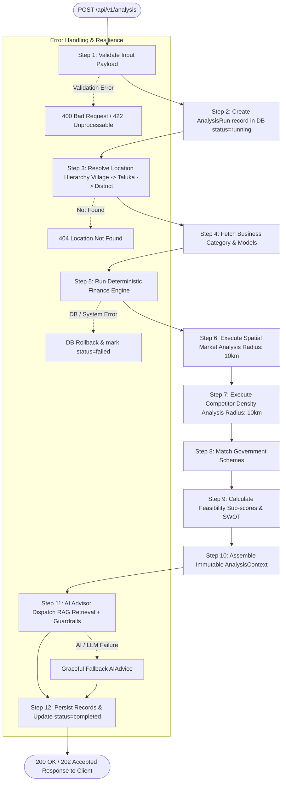
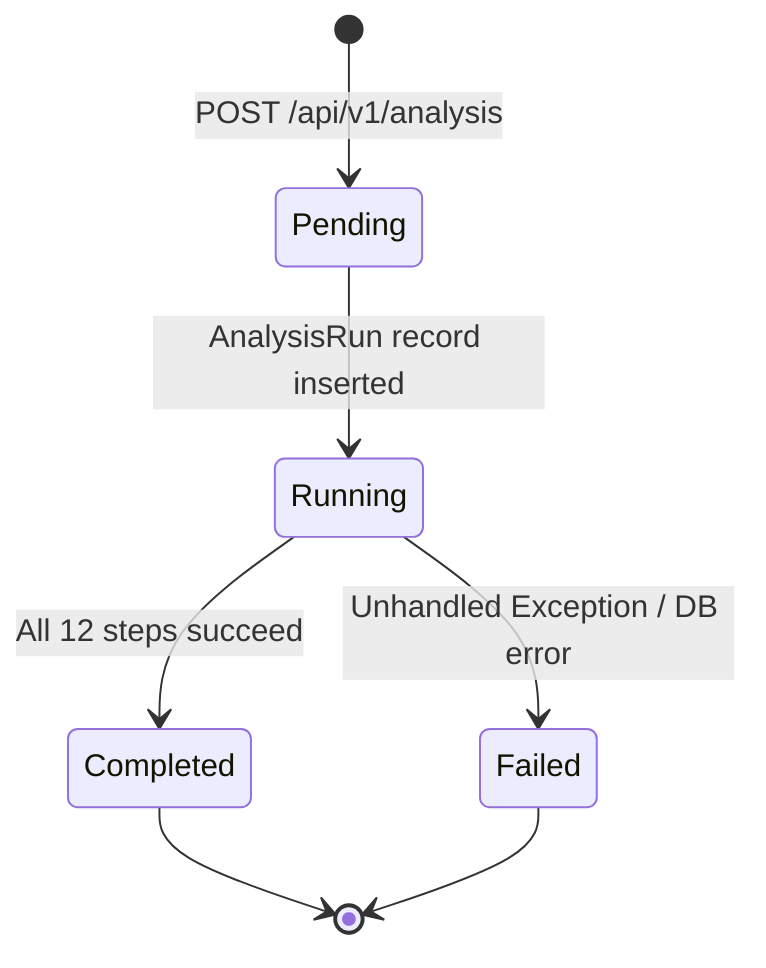

# 🔄 UdyamAI - End-to-End Analysis Workflow & Pipeline

**Version:** 1.0.0  
**Status:** Active / Production Contract  
**Orchestrator Module:** `backend/app/services/analysis_orchestrator.py`  

---

## 📌 1. Overview & Architecture Flowchart

The **Analysis Flow** is the central orchestration engine of the UdyamAI platform. When an entrepreneur requests a business feasibility study, the platform runs a deterministic, 12-step sequential pipeline integrating location demographics, business model parameters, financial mechanics, market reach, competitive density, scheme eligibility, and grounded AI advisory narratives.

---

## 🏢 2. Service Ownership & Component Matrix

| Step | Pipeline Stage | Primary Service / Module | Code Location | Responsibility |
|---|---|---|---|---|
| **1** | Input Validation | `AnalysisService` | `backend/app/services/analysis_service.py` | Validates UUIDs, profiles, locations, and business categories |
| **2** | Run Initialization | `AnalysisOrchestrator` | `backend/app/services/analysis_orchestrator.py` | Creates `AnalysisRun` record with status `running` |
| **3** | Location Hierarchy | `LocationService` | `backend/app/services/location_service.py` | Traverses Village $\rightarrow$ Taluka $\rightarrow$ District relations |
| **4** | Business Model Fetch | `BusinessService` | `backend/app/services/business_service.py` | Loads category metadata, benchmark costs, and operational profiles |
| **5** | Financial Computation | `FinanceService` / `FinanceEngine` | `backend/app/finance/calculator.py` | Evaluates equity contribution, loan caps, EMI amortization, DSCR |
| **6** | Market Demand Analysis | `MarketService` | `backend/app/services/market_service.py` | Calculates population reach, target customer size, and demand score |
| **7** | Competition Analysis | `MarketService` | `backend/app/services/market_service.py` | Computes competitor count, spatial density (units/km²), and direct/indirect split |
| **8** | Scheme Matching | `SchemeService` | `backend/app/services/scheme_service.py` | Matches profile against central/state scheme eligibility rules |
| **9** | Feasibility Scoring & SWOT | `FeasibilityService` | `backend/app/feasibility/scorer.py`, `swot.py` | Computes weighted 0-100 feasibility score and extracts empirical SWOT facts |
| **10** | Context Aggregation | `AnalysisOrchestrator` | `backend/app/schemas/ai.py` | Assembles strongly typed `AnalysisContext` |
| **11** | AI Advisory & Guardrails | `AIAdvisorService` & `RAGRetriever` | `backend/app/ai/advisor.py`, `backend/app/rag/retriever.py` | Retrieves document evidence, generates narrative, and verifies via guardrails |
| **12** | Result Persistence | `AnalysisOrchestrator` | `backend/app/services/analysis_orchestrator.py` | Commits `FeasibilityAnalysis`, `AIAnalysis`, `MarketAnalysis`, `Report` |

---

## 🔍 3. Detailed 12-Step Pipeline Breakdown

### Step 1: Validate Input Payload
- **Action**: Verifies that the incoming `AnalysisRunCreate` payload contains valid identifiers.
- **Validation Rules**:
  - `user_id`: Must exist in `Profile` table (returns `404` with `USER_NOT_FOUND` if missing).
  - `location_id` or `village_id`: Must exist in `Village` table (returns `400` if missing, `404` if not found).
  - `business_category_id`: Must exist in `BusinessCategory` table (returns `400` if missing or invalid).
  - `available_capital`: Must be $\ge 0.0$. Default: `0.0`.
  - `desired_project_cost`: Optional. Defaults to `200,000.00` if omitted.

### Step 2: Create `AnalysisRun` Record
- **Action**: Initializes an `AnalysisRun` row in PostgreSQL with `status="running"`.
- **Transaction**: The record is committed immediately and refreshed so that downstream stages have a stable foreign key (`analysis_run_id`).

### Step 3: Fetch Location Hierarchy
- **Action**: Resolves spatial administrative boundaries:
  - `Village` $\rightarrow$ retrieves PIN code, coordinates (`latitude`, `longitude`), and `taluka_id`.
  - `Taluka` $\rightarrow$ retrieves taluka name and `district_id`.
  - `District` $\rightarrow$ retrieves district name and state.
- **Failures**: Raises `404 Not Found` if any parent link is broken.

### Step 4: Fetch Business Category & Model
- **Action**: Resolves target enterprise parameters:
  - Sector (e.g., Agriculture, Manufacturing, Services).
  - Standard operational benchmarks (minimum startup capital, typical working capital requirement).

### Step 5: Run Deterministic Finance Engine
- **Action**: Invokes `FinanceService.calculate_finance` with `FinanceCalculateRequest`.
- **Calculations Performed**:
  - Raw project cost from available capital & beneficiary margin percentage.
  - Feasible project cost bounded by scheme minimum/maximum cost limits.
  - Required beneficiary equity contribution and shortfall detection.
  - Loan requirement bounded by maximum allowable loan caps.
  - Full period-by-period amortization schedule (with moratorium handling).
  - Financial stress scenarios (worst-case, expected-case, best-case) with Debt Service Coverage Ratio (DSCR).

### Step 6: Spatial Market Analysis
- **Action**: Calls `MarketService.analyze_village_market(village_id, business_category_id, radii_km=[10.0])`.
- **Outputs**:
  - Aggregate population within a 10 km spatial buffer.
  - Household reach and estimated target customer count.
  - Local commodity pricing benchmarks and price trends.
  - Deterministic market demand score (0–100) and demand level (`low`, `moderate`, `high`).

### Step 7: Spatial Competition Analysis
- **Action**: Calls `MarketService.analyze_competition_for_location(village_id, business_category_id, radius_km=10.0)`.
- **Outputs**:
  - Total registered competitor businesses within 5 km and 10 km radii.
  - Competitor density (enterprises per $\text{km}^2$).
  - Direct vs. indirect competitors distribution.
  - Threat level classification (`low`, `moderate`, `high`).

### Step 8: Government Scheme Matching
- **Action**: Queries `SchemeService.get_scheme_matches(db, analysis_run_id)` or evaluates active schemes.
- **Outputs**:
  - List of eligible or potential match schemes (e.g., PMEGP, Mudra, PMFME).
  - Match scores, satisfied criteria, missing documentation requirements, and estimated subsidy amounts.

### Step 9: Feasibility Scoring & Empirical SWOT Extraction
- **Action**: Calls `FeasibilityService.calculate_feasibility(...)`.
- **Scoring Breakdown**:
  $$\text{Overall Score} = (S_{\text{market}} \times 0.25) + (S_{\text{financial}} \times 0.25) + (S_{\text{competition}} \times 0.20) + (S_{\text{infrastructure}} \times 0.15) + (S_{\text{risk}} \times 0.15)$$
- **SWOT Generation**: Extracted strictly from empirical thresholds (e.g., population $\ge 10,000 \implies$ Strength, banking facilities $= 0 \implies$ Infrastructure Weakness). Zero LLM calls are involved in scoring.

### Step 10: Build Immutable `AnalysisContext`
- **Action**: Constructs the strongly validated Pydantic `AnalysisContext` object:
  - `location`: `LocationContext` (Village, Taluka, District)
  - `business`: `BusinessContext` (Category metadata)
  - `financial`: `FinanceCalculateResponse`
  - `market`: `MarketContext`
  - `competition`: `CompetitionContext`
  - `schemes`: `list[SchemeMatchContext]`
  - `feasibility`: `FeasibilityContext` (Scores & structured SWOT)
  - `risks`: `list[RiskContext]`
  - `language`: `"en"` | `"hi"` | `"mr"`

### Step 11: Hand Context to AI Advisor Layer
- **Action**: Passes `AnalysisContext` to `advisor.generate_advice(...)`.
- **Sub-pipeline**:
  1. Compiles natural language query from context (category, district, scheme names).
  2. Queries RAG vector store for official document citations.
  3. Formulates layered system + user prompt.
  4. Calls LLM provider abstraction (`llm.generate`).
  5. Validates raw output through `guardrails.validate` (verifies structure, sanitizes claims, blocks invented subsidies).
  6. Injects deterministic recommendation text based on numerical score.
  7. Attaches RAG conflict/missing evidence disclaimers if applicable.
- **Resilience**: If LLM, network, or validation fails, gracefully falls back to `_fallback_ai_advice` without breaking the HTTP request.

### Step 12: Save Final Results & Transition State
- **Action**: Commits all generated models in a clean database transaction:
  - `FeasibilityAnalysis`: Sub-scores, overall score, confidence, SWOT indicators.
  - `AIAnalysis`: Executive summary, actionable advice, risk narrative, next steps, prompt version.
  - `MarketAnalysis`: Demographics reach, customer estimates, pricing signals.
  - `CompetitorAnalysis`: Density, distribution, competitor counts.
  - `Report`: Localized report metadata and download bundle link.
- **Completion**: Sets `AnalysisRun.status = "completed"` and records `completed_at = timestamp`.

---

## 🛡️ 4. Transaction Boundaries & Error Handling

### Transaction Rules
1. **Isolated Run Record Creation**: The `AnalysisRun` row is committed in Step 2. This guarantees a persistent record exists even if subsequent analysis steps encounter an unrecoverable failure.
2. **Atomic Result Commit**: All result tables (`FeasibilityAnalysis`, `AIAnalysis`, `MarketAnalysis`, `CompetitorAnalysis`, `Report`) are committed together in Step 12.
3. **Rollback & Status Marking**: If any unhandled exception occurs in steps 3–10:
   - `db.rollback()` is invoked immediately to release locks and discard partial inserts.
   - A dedicated cleanup block catches the failure, updates `AnalysisRun.status = "failed"`, logs the traceback with `logger.exception`, and re-raises the HTTP error.

---

## 🚫 5. AI Boundary & Data Integrity

> [!IMPORTANT]
> **Strict AI Boundary Rules**
> 1. **Zero LLM Calculations**: Mathematical feasibility scores, financial EMIs, loan amounts, and subsidy figures are calculated **strictly by deterministic Python services** before the AI layer is invoked.
> 2. **Immutable Input**: The AI layer receives an immutable `AnalysisContext` and cannot mutate any numerical figures.
> 3. **Sanitization Guardrails**: Any AI output containing words like "guaranteed loan approval" or invented percentage figures not grounded in context is caught and rejected by `guardrails.validate`.

---

## ⚙️ 6. Assumptions & Defaults

1. **Default Radius**: Spatial market and competitor queries default to **10.0 km** if not explicitly provided.
2. **Default Financial Assumptions**:
   - Loan percentage: `75.0%` (Beneficiary contribution: `25.0%`).
   - Interest rate: `8.5%` per annum.
   - Loan tenure: `60 months` (5 years).
   - Moratorium: `6 months`.
3. **Supported Languages**: `"en"` (English), `"hi"` (Hindi), `"mr"` (Marathi). Any unsupported language code automatically defaults to `"en"`.
4. **AI Degraded Mode**: If the LLM provider fails (e.g. rate limit, timeout), the pipeline **does not crash**; instead, it populates `AIAnalysis` with verified structured data and sets `confidence = "unverified"`.

---

## ⚠️ 7. Pipeline Error Codes

| HTTP Status | Error Code | Trigger Condition |
|---|---|---|
| `400` | `MISSING_REQUIRED_FIELD` | `user_id`, `location_id`, or `business_category_id` is missing in request payload |
| `404` | `USER_NOT_FOUND` | Provided `user_id` does not match any existing profile |
| `404` | `LOCATION_NOT_FOUND` | Specified village ID does not exist in the database |
| `404` | `BUSINESS_CATEGORY_NOT_FOUND` | Specified business category ID does not exist |
| `422` | `MARKET_ANALYSIS_FAILED` | Spatial query returned no valid radius results for the location |
| `422` | `INSUFFICIENT_MARGIN` | Available capital is lower than the mandatory beneficiary contribution margin |
| `500` | `AI_UNAVAILABLE` | AI generation pipeline failed without graceful fallback |
| `500` | `DATABASE_ERROR` | PostgreSQL / PostGIS execution or connection error occurred |
| `500` | `INTERNAL_SERVER_ERROR` | Unexpected runtime error occurred during pipeline execution |
