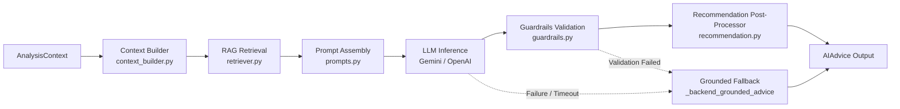
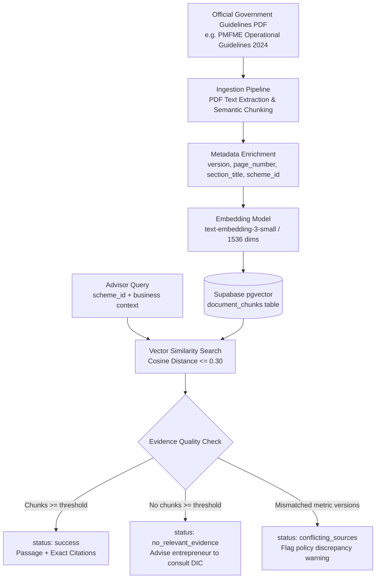

# 🧠 AI Architecture — UdyamAI Advisory & RAG Layer

**Version:** 1.0.0  
**Status:** Active / Production Baseline  
**Primary Modules:** `backend/app/ai/`, `backend/app/rag/`, `backend/app/services/analysis_orchestrator.py`

---

## 📌 1. Overview & Core Philosophy

The **UdyamAI AI Advisory Layer** translates complex, multi-dimensional quantitative feasibility analysis into actionable, culturally contextualized business guidance for rural micro-entrepreneurs.

### The Zero-Invention Boundary
```
┌────────────────────────────────────────────────────────┐
│           DETERMINISTIC BACKEND DOMAIN                 │
│  - Financial Math (EMI, Project Cost, Margin, DSCR)    │
│  - Competitor Density (Spatial buffer counts/km²)      │
│  - Market Reach (Census & Land Record population)      │
│  - Scheme Rule Matcher (Deterministic eligibility)     │
│  - Feasibility Index Scoring (Weighted 0-100 rubric)   │
└──────────────────────────┬─────────────────────────────┘
                           │ Strongly Typed Immutable
                           │ AnalysisContext
                           ▼
┌────────────────────────────────────────────────────────┐
│               AI ADVISORY DOMAIN (LLM)                 │
│  - Narrative Synthesis & Strategic Explanation         │
│  - Regional Multilingual Translation (EN / HI / MR)    │
│  - Evidence Grounding via pgvector RAG                 │
│  - Risk Mitigation & Step-by-Step Action Roadmap       │
│  * Strictly FORBIDDEN from calculating or altering math│
└────────────────────────────────────────────────────────┘
```

---

## 🔄 2. AI Advisor Pipeline

The advisory pipeline in `backend/app/ai/advisor.py` executes in six resilient stages:



1. **Context Building (`context_builder.py`):**
   Aggregates the strongly typed `AnalysisContext` into an optimized payload, identifying key strengths, weaknesses, margin shortfalls, and candidate government schemes.
2. **RAG Evidence Retrieval (`retriever.py`):**
   Executes vector similarity search against `document_chunks` using `pgvector` to pull verified policy passages for matched schemes.
3. **Prompt Assembly (`prompts.py`):**
   Injects verified facts, system directives, localized language requirements (`en`, `hi`, `mr`), and strict formatting constraints into the LLM system prompt.
4. **LLM Inference (`llm.py`):**
   Dispatches the prompt to Google Gemini (`gemini-3.6-flash` / `gemini-1.5-pro`) or OpenAI (`gpt-4o-mini`), configured with low temperature (0.2) for maximum factual adherence.
5. **Guardrails Enforcement (`guardrails.py`):**
   Validates that the returned JSON strictly conforms to `AIAdvice` schemas and ensures no unauthorized financial figures or hallucinations violate input bounds.
6. **Recommendation Synthesis (`recommendation.py`):**
   Finalizes recommendation status (`RECOMMENDED`, `CONDITIONAL`, `NOT_RECOMMENDED`) ensuring alignment with the deterministic feasibility score.

---

## 📋 3. Data Contracts

### A. Input Contract — `AnalysisContext`
As defined in `backend/app/schemas/ai.py` and `docs/ai-contract.md`:
```python
class AnalysisContext(BaseModel):
    location: LocationContext
    business: BusinessContext
    financial: FinanceCalculateResponse
    market: MarketContext
    competition: CompetitionContext
    schemes: list[SchemeMatchContext] = Field(default_factory=list)
    feasibility: FeasibilityContext
    risks: list[RiskContext] = Field(default_factory=list)
    language: str = "en"  # "en" | "hi" | "mr"
```

### B. Output Contract — `AIAdvice`
```python
class AIAdvice(BaseModel):
    summary: str
    recommendation: str  # "RECOMMENDED" | "CONDITIONAL" | "NOT_RECOMMENDED"
    reasoning: list[str]
    market_advice: list[str]
    financial_advice: list[str]
    scheme_advice: list[str]
    competition_advice: list[str]
    risks: list[str]
    next_steps: list[str]
    confidence: str  # "high" | "medium" | "low"
    rag_evidence: list[RAGChunkEvidence] = Field(default_factory=list)
```

---

## 📚 4. RAG Retrieval Architecture

The RAG layer connects the AI advisor to primary government sources:



### Source Provenance Schema
Every retrieved chunk must supply verifiable metadata:
- `document_id`: UUID of official document in `documents` table
- `title`: e.g., "PMFME Scheme Guidelines 2024"
- `page_number`: Exact PDF page number for physical audit
- `section_title`: Section heading (e.g., "4.2 Beneficiary Contribution & Subsidy Cap")
- `source_url`: Official `.gov.in` portal URL

---

## 🌐 5. Multilingual Localization Architecture

To serve entrepreneurs in rural Maharashtra and across India, the AI layer supports three languages:
- **English (`en`):** Default administrative and reporting language.
- **Hindi (`hi`):** National lingua franca for North/Central entrepreneurship.
- **Marathi (`mr`):** Primary vernacular language for Maharashtra grassroots deployment.

### Localization Mechanism
1. **Dynamic Prompt Persona:** Prompts instruct the model to adopt the persona of a senior rural enterprise consultant fluent in the chosen language.
2. **Domain Glossaries:** Prevents awkward literal machine translations for financial terms (e.g., "Beneficiary Contribution" translates to Marathi *"स्वतःचे भांडवल / लाभार्थी हिस्सा"*, "Working Capital" to *"खेळते भांडवल"*, "Subsidy" to *"अनुदान"*).
3. **Structured Response Preservation:** All JSON schema keys remain strictly ASCII English; only the text content values are translated.

---

## 🛡️ 6. Resilient Fallback Architecture

If the AI provider encounters rate limits (HTTP 429), API downtime (HTTP 500/503), invalid JSON parsing, or guardrail rejections, `_backend_grounded_advice` automatically engages:

```python
# Fallback guarantee in advisor.py
try:
    # 1. LLM Generation and Guardrail validation
    advice = generate_llm_advice(context, language)
except Exception as exc:
    logger.warning(
        "LLM generation failed: %s; falling back to deterministic advice", exc
    )
    advice = _backend_grounded_advice(prepared_context, language=language)
```

The fallback advice synthesizes the verified feasibility scores, financial summary, and scheme matches into structured advisory bullet points using rule-based templates. The user's analysis pipeline **never fails** due to an external AI outage.
