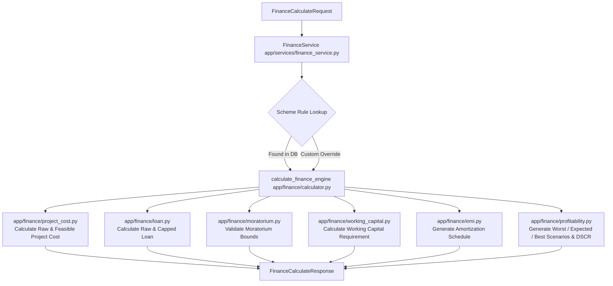
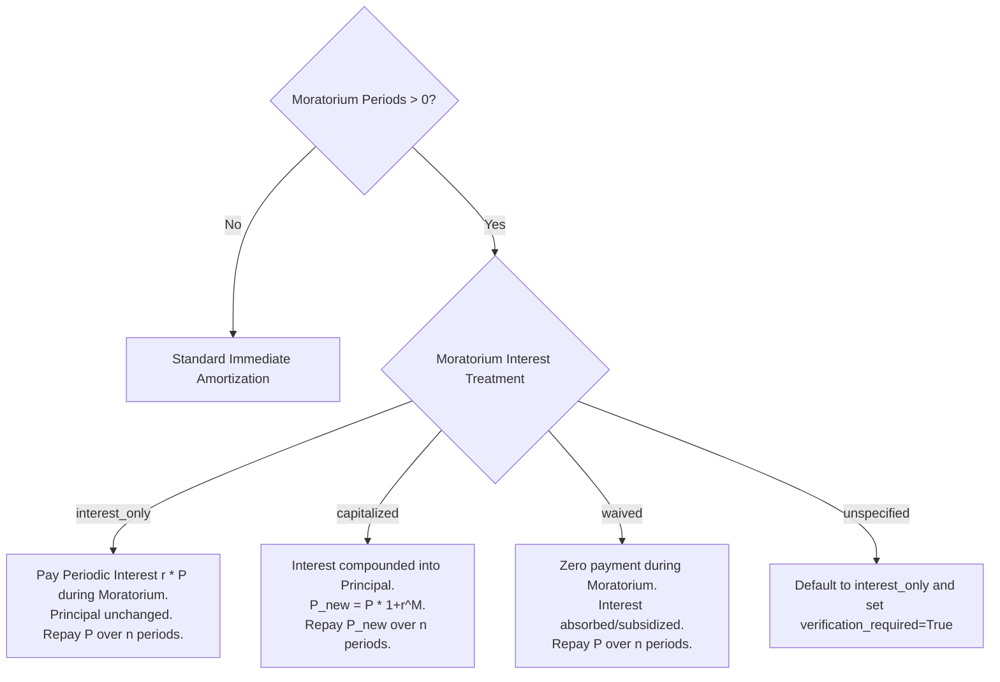

# 💰 UdyamAI - Finance Engine Specification

**Version:** 1.0.0  
**Status:** Active / Production Contract  
**Primary Modules:** `backend/app/finance/` and `backend/app/services/finance_service.py`  

---

## 📌 1. Overview & Core Philosophy

The **UdyamAI Finance Engine** executes rigorous, deterministic, scheme-rule driven financial computations for rural micro-enterprises. It translates entrepreneur equity, government scheme rules, capital investment requirements, and credit limits into:
1. **Feasible Project Cost & Equity Shortfall Detection**
2. **Potential Loan Sizing & Debt Caps**
3. **Period-by-Period Amortization Schedules** (supporting monthly, quarterly, semi-annual, and annual frequencies)
4. **Moratorium Interest Treatments** (Interest-Only, Capitalized, Waived)
5. **Stress Scenarios & Repayment Coverage (DSCR)**

### 🔒 Non-Negotiable Core Principle
> [!IMPORTANT]
> **Deterministic Math & Zero Invention Rule**
> - All financial figures are computed via pure deterministic Python functions. **No LLM or AI model is permitted to calculate or alter any financial figure.**
> - **"Do not invent local revenue numbers"**: If no verified revenue data or explicit user assumptions are provided, the engine will explicitly flag `sufficient_assumptions_exist = False` and refuse to fabricate revenue or cash flow numbers.

---

## 🏢 2. Service Ownership & Architecture



### Module Responsibilities

| Module | Location | Core Function |
|---|---|---|
| `calculator.py` | `backend/app/finance/calculator.py` | Central orchestrator coordinating caps, shortfalls, schedules, and scenario generation |
| `project_cost.py` | `backend/app/finance/project_cost.py` | Computes raw project cost, applies scheme caps (`min_project_cost`, `max_project_cost`), and calculates required margin equity |
| `loan.py` | `backend/app/finance/loan.py` | Computes raw loan requirement and applies scheme credit ceilings (`max_loan_amount`) |
| `moratorium.py` | `backend/app/finance/moratorium.py` | Validates moratorium duration against tenure ($0 \le \text{moratorium} < \text{tenure}$) |
| `working_capital.py` | `backend/app/finance/working_capital.py` | Computes dedicated working capital allocation based on scheme percentage |
| `emi.py` | `backend/app/finance/emi.py` | Amortization math, payment period conversion, and moratorium interest handling |
| `profitability.py` | `backend/app/finance/profitability.py` | Financial scenario simulation, cash surplus, and Debt Service Coverage Ratio (DSCR) |
| `finance_service.py` | `backend/app/services/finance_service.py` | Service boundary integrating DB session, scheme rules, and API response mappings |

---

## 📐 3. Mathematical Formulas & Calculation Rules

### A. Raw Project Cost
Determines maximum achievable project size from available entrepreneur equity and scheme beneficiary margin:
$$\text{Project Cost}_{\text{raw}} = \frac{\text{Available Capital}}{\text{Beneficiary Contribution Percent} / 100}$$

*Example: If entrepreneur has ₹50,000 available capital and the scheme requires 25% equity:*
$$\text{Project Cost}_{\text{raw}} = \frac{50,000}{0.25} = 200,000$$

### B. Target Cost & Feasible Project Cost with Scheme Caps
If the user provides a `desired_project_cost`, target cost is bounded by raw capacity:
$$\text{Target Cost} = \begin{cases} \min(\text{Project Cost}_{\text{raw}}, \text{Desired Project Cost}), & \text{if Desired Project Cost} > 0 \\ \text{Project Cost}_{\text{raw}}, & \text{otherwise} \end{cases}$$

Scheme limits are then applied:
$$\text{Feasible Project Cost} = \min(\max(\text{Target Cost}, \text{Min Project Cost}), \text{Max Project Cost})$$

### C. Required Contribution & Margin Shortfall Detection
$$\text{Required Contribution} = \text{Feasible Project Cost} \times \left(\frac{\text{Beneficiary Contribution Percent}}{100}\right)$$
$$\text{Margin Shortfall} = \max(0.0, \text{Required Contribution} - \text{Available Capital})$$

#### Special Status Outcomes:
1. **`insufficient_margin`**: Triggered when $\text{Available Capital} < \text{Required Contribution for Desired Project Cost}$.
2. **`below_minimum_cost`**: Triggered when $\text{Target Cost} < \text{Min Project Cost}$.

### D. Potential Loan Sizing & Loan Cap
$$\text{Raw Loan} = \text{Feasible Project Cost} \times \left(\frac{\text{Loan Percent}}{100}\right)$$
$$\text{Potential Loan} = \begin{cases} \min(\text{Raw Loan}, \text{Max Loan Amount}), & \text{if Max Loan Amount specified} \\ \text{Raw Loan}, & \text{otherwise} \end{cases}$$

### E. Dedicated Working Capital Allocation
$$\text{Working Capital} = \text{Feasible Project Cost} \times \left(\frac{\text{Working Capital Percent}}{100}\right)$$

---

## 📅 4. Amortization & Moratorium Rules

### Payment Frequencies & Period Calculations
The engine supports four scheme payment cycles:

| Payment Frequency | Periods Per Year ($k$) | Months Per Period ($m$) |
|---|---|---|
| `monthly` | 12 | 1 |
| `quarterly` | 4 | 3 |
| `semi_annually` | 2 | 6 |
| `annually` | 1 | 12 |

Period calculations use **ceiling logic** ($\lceil \cdot \rceil$) so partial periods are cleanly accounted for:
$$\text{Total Periods } (N) = \left\lceil \frac{\text{Tenure Months}}{m} \right\rceil$$
$$\text{Moratorium Periods } (M) = \min\left(\left\lceil \frac{\text{Moratorium Months}}{m} \right\rceil, N - 1\right)$$
$$\text{Active Repayment Periods } (n) = N - M$$

Periodic interest rate ($r$):
$$r = \frac{\text{Annual Interest Rate} / k}{100}$$

### Amortization Installment Formula (Standard Annuity)
For active repayment periods:
$$\text{Installment Amount (EMI)} = P \times \frac{r(1+r)^n}{(1+r)^n - 1}$$
*(If $r = 0$, $\text{EMI} = \frac{P}{n}$)*

### Moratorium Interest Treatment Policies
When $\text{Moratorium Months} > 0$, the engine adheres strictly to the scheme's specified policy:



1. **`interest_only`**:
   - During Moratorium ($1 \le t \le M$): $\text{Payment}_t = P \times r$, $\text{Principal Paid}_t = 0$.
   - Active Periods ($M+1 \le t \le N$): Regular amortized installments paying off original $P$.
2. **`capitalized`**:
   - During Moratorium ($1 \le t \le M$): $\text{Payment}_t = 0$. Unpaid interest is compounded: $P_{t} = P_{t-1} \times (1 + r)$.
   - Active Periods: Repayment calculated on escalated principal $P_{\text{cap}} = P \times (1 + r)^M$.
3. **`waived`**:
   - During Moratorium ($1 \le t \le M$): $\text{Payment}_t = 0$, $\text{Interest}_t = 0$.
   - Active Periods: Regular amortized installments paying off original $P$.

---

## 📊 5. Financial Scenarios & DSCR Analysis

The engine generates three standard forward-looking scenarios:
- `worst_case`: Lower revenue multiplier, higher operating cost multiplier.
- `expected_case`: Baseline multipliers ($1.0\times$ revenue, $1.0\times$ costs).
- `best_case`: Higher revenue multiplier, lower operating cost multiplier.

### Data Source Hierarchy:
1. **Verified Data** (`verified_revenue`, `verified_operating_cost`) $\rightarrow$ Priority 1
2. **Explicit User Assumptions** (`monthly_revenue`, `monthly_operating_cost`) $\rightarrow$ Priority 2
3. **No Data Provided** $\rightarrow$ Sets `sufficient_assumptions_exist = False`. Zero fictitious numbers returned.

### Metric Computations per Scenario:
$$\text{Scenario Revenue} = \text{Base Revenue} \times M_{\text{rev}}$$
$$\text{Scenario Operating Cost} = \text{Base Cost} \times M_{\text{cost}}$$
$$\text{Surplus (Operating Profit)} = \text{Scenario Revenue} - \text{Scenario Operating Cost}$$
$$\text{Cash Surplus} = \text{Surplus} - \text{Monthly EMI}$$
$$\text{Debt Service Coverage Ratio (DSCR)} = \frac{\text{Surplus}}{\text{Monthly EMI}}$$

*DSCR Interpretation:*
- $\text{DSCR} \ge 1.5$: Strong debt repayment capacity.
- $1.0 \le \text{DSCR} < 1.5$: Moderate repayment capacity, sensitive to market shifts.
- $\text{DSCR} < 1.0$: High default risk (operating surplus does not cover debt obligations).

---

## 📋 6. API Request & Response Schemas

### Request Schema (`FinanceCalculateRequest`)
```json
{
  "available_capital": 50000.0,
  "desired_project_cost": 200000.0,
  "scheme_id": "3fa85f64-5717-4562-b3fc-2c963f66afa6",
  "monthly_revenue": 45000.0,
  "monthly_operating_cost": 25000.0,
  "loan_percent": 75.0,
  "interest_rate": 8.5,
  "tenure_months": 60,
  "moratorium_months": 6,
  "payment_frequency": "monthly",
  "moratorium_interest_treatment": "interest_only"
}
```

### Response Schema (`FinanceCalculateResponse`)
```json
{
  "status": "success",
  "available_capital": 50000.0,
  "required_contribution": 50000.0,
  "shortfall": 0.0,
  "desired_project_cost": 200000.0,
  "feasible_project_cost": 200000.0,
  "potential_loan": 150000.0,
  "monthly_emi": 3077.25,
  "total_interest": 34635.0,
  "total_repayment": 184635.0,
  "working_capital": 40000.0,
  "project_cost_cap_applied": false,
  "loan_cap_applied": false,
  "verification_required": false,
  "repayment_schedule": [
    {
      "period": 1,
      "opening_balance": 150000.0,
      "installment": 1062.5,
      "principal": 0.0,
      "interest": 1062.5,
      "closing_balance": 150000.0,
      "is_moratorium": true
    },
    {
      "period": 7,
      "opening_balance": 150000.0,
      "installment": 3358.42,
      "principal": 2295.92,
      "interest": 1062.5,
      "closing_balance": 147704.08,
      "is_moratorium": false
    }
  ],
  "scenarios": [
    {
      "scenario_type": "expected_case",
      "sufficient_assumptions_exist": true,
      "revenue": 45000.0,
      "operating_costs": 25000.0,
      "surplus": 20000.0,
      "loan_repayment": 3077.25,
      "cash_surplus": 16922.75,
      "repayment_coverage": 6.5,
      "data_source": "explicit_user_assumptions"
    }
  ]
}
```

---

## ⚙️ 7. Default Parameters & Fallback Assumptions

When scheme rules do not specify optional financial parameters, the engine applies standard national micro-lending defaults:

| Parameter | Default Value | Fallback Source |
|---|---|---|
| `beneficiary_contribution_percent` | `25.0%` | `settings.DEFAULT_BENEFICIARY_CONTRIBUTION_PERCENT` |
| `loan_percent` | $\max(0.0, 100.0 - \text{contribution})$ | Computed complement |
| `interest_rate` | `9.0%` | `settings.DEFAULT_INTEREST_RATE` |
| `tenure_months` | `60` (5 years) | `settings.DEFAULT_TENURE_MONTHS` |
| `payment_frequency` | `"monthly"` | `settings.DEFAULT_PAYMENT_FREQUENCY` |
| `moratorium_months` | `0` | Defaults to zero if unspecified |
| `working_capital_percent` | `20.0%` | Benchmark industry standard |

---

## ⚠️ 8. Error Codes & Status Indicators

| Status / Code | Description | Action / Recovery |
|---|---|---|
| `success` | Calculation completed successfully | Proceed to feasibility & AI narrative layer |
| `insufficient_margin` | Available capital is lower than required scheme margin | Prompt entrepreneur to increase equity or scale down project cost |
| `below_minimum_cost` | Feasible cost is below minimum scheme limit | Inform user of minimum scheme threshold |
| `INVALID_SCHEME_RULE` | Database rule contains negative interest or $0$ tenure | Administrator must update scheme rule configuration |
| `CALCULATION_ERROR` | Mathematical exception (e.g. division by zero) | Engine falls back to safe zero amortization and logs error |
| `MISSING_REQUIRED_FIELD` | `available_capital` missing or $< 0$ | Return 400 Bad Request to API caller |
